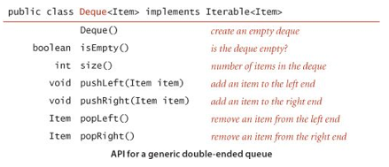

# Laboratory practice

## Q&A

1. How do I create an array of stacks of strings? Write an example.
2. What happens if my program calls pop() for an empty stack? What's the behavior of the [Java Stack](http://docs.oracle.com/javase/7/docs/api/java/util/Stack.html) class?
3. Can I use a foreach loop with strings? Explain your answer.

## Exercises

1. Write an implementation for the Stack, Bag & Queue classes using a linked-list data structure. The implementations must be Iterable & Generic.
2. Write a stack client Parentheses that reads in a text stream from standard input and uses a stack to determine whether its parentheses are properly balanced. For example, your program should print true for `[()]{}{[()()]()}` and false for `[(])`.
3. What does the following code fragment do to the queue q?

	```
	Stack < String > stack = new Stack < String >(); 
	while (! q.isEmpty())
		stack.push( q.dequeue());
	while (! stack.isEmpty())
		q.enqueue( stack.pop());
	```

4. Write a program that takes from standard input an expression without left parentheses and prints the equivalent [infix](http://www.cs.man.ac.uk/~pjj/cs212/fix.html) expression with the parentheses inserted. For example, given the input:

	`1 + 2 ) * 3 - 4 ) * 5 - 6 ) ) )`	

	your program should print 
	
	`( ( 1 + 2 ) * ( ( 3 - 4 ) * ( 5 - 6 ) ) )`

### Linked-List

1. Suppose `x` is a linked-list node and not the last node on the list. What is the effect of the following code fragment?

	`x.next = x.next.next;`

2. Write a method delete() that takes an int argument k and deletes the kth element in a linked list, if it exists.
3. Write a method max() that takes a reference to the first node in a linked list as argument and returns the value of the maximum key in the list. Assume that all keys are positive integers, and return 0 if the list is empty.
4. Write a `Queue` implementation that uses a *circular* linked list, which is the same as a linked list except that no links are *null* and the value of `last.next` is `first` whenever the list is not empty. Keep only one Node instance variable (`last`).
5. Implement a nested class `DoubleNode` for building doubly-linked lists, where each node contains a reference to the item preceding it and the item following it in the list (`null` if there is no such item). Then implement static methods for the following tasks: insert at the beginning, insert at the end, remove from the beginning, remove from the end, insert before a given node, insert after a given node, and remove a given node.
6. Deque. A double-ended queue or *deque* (pronounced "deck") is like a stack or a queue but supports adding and removing items at both ends. A deque stores a collection of items and supports the following API:

	

	Write a class `Deque` that uses a doubly-linked list to implement this API

7. `Move-to-front`. Read in a sequence of characters from standard input and maintain the characters in a linked list with no duplicates. When you read in a previously unseen character, insert it at the front of the list. When you read in a duplicate character, delete it from the list and reinsert it at the beginning. Name your program `MoveToFront`: it implements the well-known `move-to-front` strategy, which is useful for caching, data compression, and many other applications where items that have been recently accessed are more likely to be reaccessed.
8. Listing files. A folder is a list of files and folders. Write a program that takes the name of a folder as a command-line argument and prints out all of the files contained in that folder, with the contents of each folder recursively listed (indented) under that folder’s name. Hint: Use a queue, and see `java.io.File`.